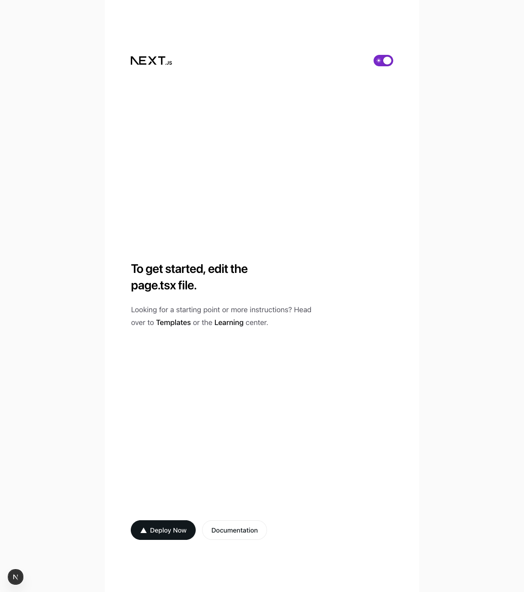

Ya tenemos Next instalado, pero ahora necesitamos integrar el resto de componentes que vamos a necesitar para trabajar.

## HeroUI

Esta librería de componentes se apoya en TailwindCSS con lo que su instalación nos dará muy pocos problemas y viene bien descrita en la [web oficial](https://www.heroui.com/docs/frameworks/nextjs). En cualquier caso, vamos a instalarlo con el paquete `@heroicons/react`, que nos permitirá tener un paquete de iconos en la aplicación y con `next-themes` para poder aplicar tema oscuro o
claro.

```bash
npm install @heroui/react framer-motion @heroicons/react next-themes
```

Ahora necesitamos configurar el fichero de estilos de `tailwindcss` para que soporte los componentes de HeroUI. Creamos el siguiente archivo:

```typescript title="src/app/hero.ts"
import { heroui } from '@heroui/react'
export default heroui()
```

E instalamos el plugin en el fichero de estilos de _Next_. Borramos todo el contenido y lo dejamos así:

```css title="src/app/globals.css"
@import "tailwindcss";
@plugin "./hero.ts";
@source "../../node_modules/@heroui/theme/dist/**/*.{js,ts,jsx,tsx}";
@custom-variant dark (&:is(.dark *));
```

### Dark theme

Para poder aplicar el tema oscuro o claro en nuestra aplicación, necesitamos configurar una librería llamada `next-theme`. En este caso HeroUI también lo explica en la [web oficial](https://www.heroui.com/docs/customization/dark-mode).

Necesitamos, en cualquier caso crear un nuevo fichero con los providers de HeroUI con el siguiente contenido:

```typescript title="src/app/providers.tsx"
'use client'

import { HeroUIProvider } from '@heroui/system'
import { useRouter } from 'next/navigation'
import type { ThemeProviderProps } from 'next-themes'
import { ThemeProvider as NextThemesProvider } from 'next-themes'
import type * as React from 'react'

export interface ProvidersProps {
  children: React.ReactNode
  themeProps?: ThemeProviderProps
}

declare module '@react-types/shared' {
  interface RouterConfig {
    routerOptions: NonNullable<
      Parameters<ReturnType<typeof useRouter>['push']>[1]
    >
  }
}

export function Providers({ children, themeProps }: ProvidersProps) {
  const router = useRouter()

  return (
    <HeroUIProvider navigate={router.push}>
      <NextThemesProvider {...themeProps}>{children}</NextThemesProvider>
    </HeroUIProvider>
  )
}
```

!!! info
    La notación ```'use client'``` es exclusiva de algunos frameworks con soporte de `React Server Components`. Se verá su uso durante el curso.

Y este archivo de providers se debe cargar en el layout principal:

```typescript title="src/app/layout.tsx"
import type { Metadata, Viewport } from 'next'
import { Geist, Geist_Mono } from 'next/font/google'
import './globals.css'
import { Providers } from './providers'

const geistSans = Geist({
  variable: '--font-geist-sans',
  subsets: ['latin'],
})

const geistMono = Geist_Mono({
  variable: '--font-geist-mono',
  subsets: ['latin'],
})

export const metadata: Metadata = {
  description: 'Aplicación del taller de Next del Aula de Software Libre',
  title: 'Taller de Next con Typescript',
}

export const viewport: Viewport = {
  themeColor: [
    { media: '(prefers-color-scheme: light)', color: 'white' },
    { media: '(prefers-color-scheme: dark)', color: 'black' },
  ],
}

export default function RootLayout({
  children,
}: Readonly<{
  children: React.ReactNode
}>) {
  return (
    <html lang="en" suppressHydrationWarning>
      <body
        className={`${geistSans.variable} ${geistMono.variable} bg-background text-foreground antialiased`}
      >
        <Providers themeProps={{ attribute: 'class', defaultTheme: 'dark' }}>
          {children}
        </Providers>
      </body>
    </html>
  )
}
```

### Nuestro primer componente: ThemeSwitcher

Para poder ver en funcionamiento el selector de tema claro/oscuro, vamos a crear un _switch_ para cambiar de un tema a otro.

Para eso crearemos el siguiente componente:

```typescript title="src/components/theme-switcher/theme-switcher.tsx"
'use client'

import { MoonIcon, SunIcon } from '@heroicons/react/24/solid'
import { Switch } from '@heroui/react'
import { useTheme } from 'next-themes'
import { useEffect, useState } from 'react'

/**
 * Theme dark/light switcher
 */
export function ThemeSwitcher() {
  const [mounted, setMounted] = useState(false) // (1)
  const { setTheme, theme } = useTheme() // (2)

  useEffect(() => {
    setMounted(true) // (3)
  }, [setMounted])

  if (!mounted) return null

  return (
    <Switch
      defaultSelected={theme === 'light'}
      size="md"
      color="secondary"
      onClick={() => setTheme(theme === 'dark' ? 'light' : 'dark')}
      startContent={<SunIcon />}
      endContent={<MoonIcon />}
    />
  )
}
```

1. Hook para comprobar si el componente ya ha sido montado.
2. Hook proporcionado por next-themes para conocer el tema y cambiarlo.
3. Esta función se ejecuta una sola vez, justo después de que el componente se haya montado, y cambia el estado del hook a _true_.


Vamos a probar a añadir nuestro componente a la pagina principal:

``` { .typescript .no-copy title="src/app/page.tsx" hl_lines="2 10-20" linenums="1" }
import Image from 'next/image'
import { ThemeSwitcher } from '@/components/theme-switcher/theme-switcher'

export default function Home() {
  return (
    <div className="flex min-h-screen items-center justify-center bg-zinc-50
     font-sans dark:bg-black">
      <main className="flex min-h-screen w-full max-w-3xl flex-col items-center
       justify-between bg-white px-16 py-32 sm:items-start dark:bg-black">
        <div className="flex min-h-10 w-full justify-between">
          <Image
            alt="Next.js logo"
            className="dark:invert"
            height={20}
            priority
            src="/next.svg"
            width={100}
          />
          <ThemeSwitcher /> {/* (1) */}
        </div>
        <div className="flex flex-col items-center gap-6 text-center
         sm:items-start sm:text-left">
          <h1 className="max-w-xs font-semibold text-3xl text-black leading-10
           tracking-tight dark:text-zinc-50">
            To get started, edit the page.tsx file.
          </h1>
```

1. Añadimos el componente después del logo de Vercel. El IDE importará automáticamente el componente.

!!! warning

    En este caso no puedes copiar y pegar el código. Aprende a importar y usar
    componentes.

    Hay dos maneras de escribir una marca HTML. Si la marca tiene contenido:

    ```html
    <div>Content</div>
    ```

    Y si no lo tiene, como es el caso de nuestro componente:

    ```html
    <ThemeSwitcher />
    ```


Ahora, ya tendremos la página principal con nuestro componente para cambiar al tema claro:

