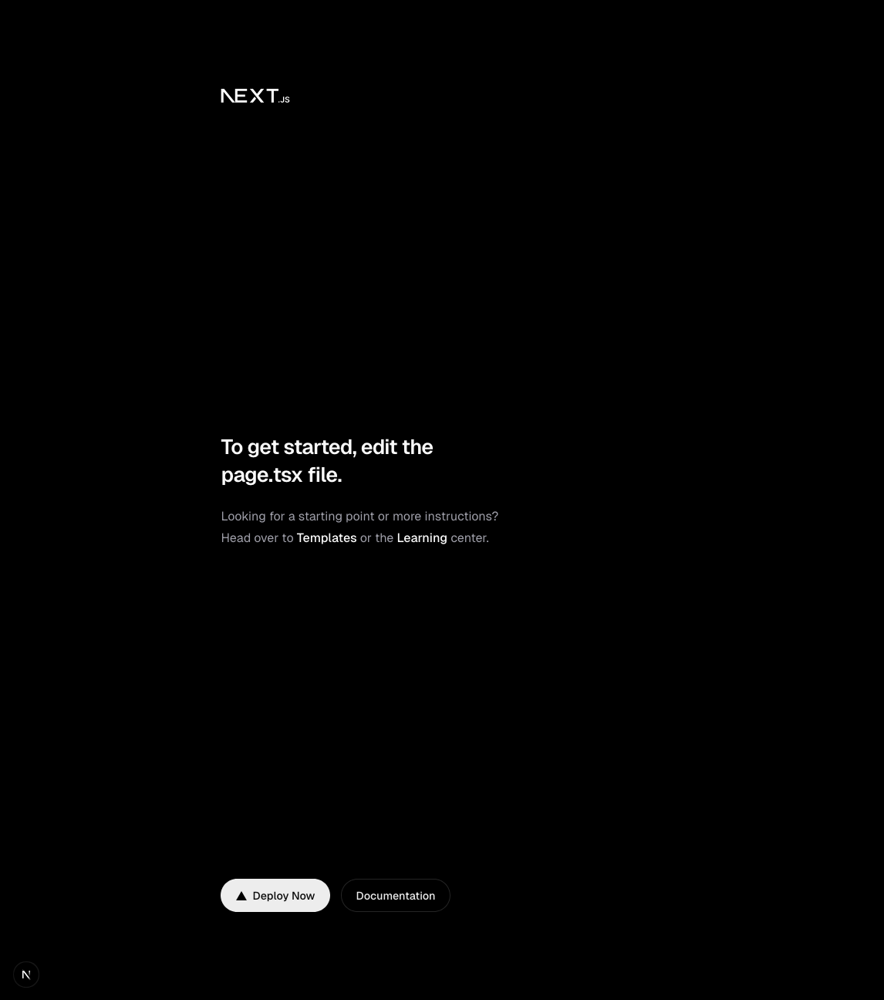

Crear un boilerplate desde cero para hacer funcionar múltiples herramientas de Node.js, como React, NextUI, Jest y Storybook, puede ser una tarea desafiante y propensa a errores, especialmente para los novatos. Los problemas de configuración, las dependencias en conflicto y las incompatibilidades pueden ser una fuente de frustración significativa. Esto puede desanimar a los principiantes y hacer que el proceso de inicio sea más largo y complicado de lo deseado, en lugar de permitirles centrarse directamente en el desarrollo de sus aplicaciones.

## Instalar Next

Aunque Next tiene una forma canónica de instalarse a través de la herramienta `npx`, el proyecto tienen una [multitud de ejemplos](https://github.com/vercel/next.js/tree/canary/examples) donde podemos descargar next ya integrado con alguna librería que nos interese.

```bash
npx create-next-app@latest taller-de-next-con-typescript-code --biome --yes
```

!!! info
    Vamos a usar biome para mantener el correcto formato de nuestros ficheros en vez de eslint que es el software de corrección por defecto.

Después de lo cual podemos abrir el nuevo directorio con nuestro IDE y ejecutar el servidor de desarrollo:

```bash
cd taller-de-next-con-typescript-code
npm run dev
```



## Linting

El **linting** es una práctica esencial en el desarrollo de software que consiste en analizar el código fuente en busca de errores, inconsistencias y malas prácticas. En este curso utilizaremos **Biome**, una herramienta moderna escrita en Rust que combina linting y formateo en un único binario, simplificando la configuración y acelerando las comprobaciones respecto a la clásica pareja ESLint + Prettier.

Biome incluye reglas de estilo y de calidad listas para usarse, detecta patrones problemáticos y mantiene un formato consistente del código sin necesidad de herramientas adicionales. Si vienes de ESLint te resultará familiar: muchas reglas tienen equivalentes directos y puedes extender la configuración mediante un único fichero `biome.json`.

Al crear el proyecto con `--biome`, Next.js ya genera la configuración inicial y un script `npm run lint` que ejecuta `biome check`. Aun así conviene revisar el archivo `biome.json` para ajustar reglas como el orden de los imports, la política de comillas o cualquier preferencia de estilo que tenga tu equipo.


### Ultracite

Aunque _Next_ ya viene con una configuración por defecto de biome, el proyecto [Ultracite](https://www.ultracite.ai/) proporciona una configuración más avanzada, además de que nos permite configurar otros aspectos como el editor, los hooks de git e incluso la interacción con agentes de programación. Ejecuta lo siguiente:

```bash
npx ultracite@latest init --editors vscode --frameworks next --integrations lefthook
```

!!! info
    El instalador nos preguntará si queremos instalar la integración con algún agente. En este curso no vamos a usar ninguno, así que puedes ignorar este paso y darle a INTRO.

Y a continuación vamos a editar el archivo `biome.jsonc` con este contenido:


```json title="biome.jsonc"
{
  "$schema": "./node_modules/@biomejs/biome/configuration_schema.json",
  "extends": [
    "ultracite/core",
    "ultracite/next"
  ],
  "linter": {
    "rules": {
      "style": {
        "useConsistentTypeDefinitions": {
          "level": "warn",
          "options": {
            "style": "interface"
          }
        }
      }
    }
  },
  "javascript": {
    "formatter": {
      "semicolons": "asNeeded",
      "quoteStyle": "single"
    }
  }
}
```


!!! note
    No vamos a explicar lo que significa cada opción, se recomienda ir a la
    documentacion de Biome para ver el significado de las
    reglas utilizadas. Estas reglas son solo un ejemplo y cada persona
    o grupo de desarrollo puede tener las suyas propias. Así que no deben tomarse
    como algo dogmático.


Y vamos a configurar nuestro proyecto para que use _Biome_ con estas dos órdenes:

```bash
npm pkg set scripts.lint="ultracite check"
npm pkg set scripts.format="ultracite fix"
```

Ahora si ejecutamos el linter en la línea de comandos:

```bash
npm run lint
```

Veremos que encuentra algunos errores de lintado. Podemos corregirlos automáticamente ejecutando lo siguiente:

```bash
npm run format
```
```


```bash
npm run lint -- --fix
```

### Lintado con Visual Studio Code

Obviamente no es muy cómodo. Podemos hacerlo de forma automática al guardar
el fichero en vscode. Biome para ello nos ha creado este fichero:

```json title=".vscode/settings.json"
{
  "editor.defaultFormatter": "esbenp.prettier-vscode",
  "[javascript]": {
    "editor.defaultFormatter": "biomejs.biome"
  },
  "[typescript]": {
    "editor.defaultFormatter": "biomejs.biome"
  },
  "[javascriptreact]": {
    "editor.defaultFormatter": "biomejs.biome"
  },
  "[typescriptreact]": {
    "editor.defaultFormatter": "biomejs.biome"
  },
  "[json]": {
    "editor.defaultFormatter": "biomejs.biome"
  },
  "[jsonc]": {
    "editor.defaultFormatter": "biomejs.biome"
  },
  "[css]": {
    "editor.defaultFormatter": "biomejs.biome"
  },
  "[graphql]": {
    "editor.defaultFormatter": "biomejs.biome"
  },
  "typescript.tsdk": "node_modules/typescript/lib",
  "editor.formatOnSave": true,
  "editor.formatOnPaste": true,
  "emmet.showExpandedAbbreviation": "never",
  "editor.codeActionsOnSave": {
    "source.fixAll.biome": "explicit",
    "source.organizeImports.biome": "explicit"
  }
}

```

Esta configuración de vscode es exclusiva para este proyecto, se puede
configurar para que lo haga en todos los que creemos si configuramos
estas opciones en el entorno de usuario. 

Probablemente veamos un error indicando que el plugin `esbenp.prettier-vscode`  y el plugin `biomejs.biome` 
no existen, debido a que probablemente no lo tengamos instalado. Los IDE
suelen proporcionar plugins que facilitan el trabajo. Si quieres, puedes instalar
ess extensiones manualmente o crear este fichero que te recomendará instalar
varias extensiones que usaremos en este taller. 


```json title=".vscode/extensions.json"
{
  "recommendations": [
    "esbenp.prettier-vscode",
    "vitest.explorer",
    "bradlc.vscode-tailwindcss",
    "biomejs.biome",
    "usernamehw.errorlens"
  ]
}
```

Se recomienda ver el [Taller de VSCode](https://aulasoftwarelibre.github.io/taller-vscode/).

## Git hooks

Hemos visto ya como formatear automáticamente nuestros ficheros desde vscode,
pero eso tiene un problema, si algún fichero se edita de otra manera o hay
algún problema con el editor, puede que se nos escape algún fichero con el 
formato incorrecto.

Necesitamos estar completamente seguro que no vamos a commitear a nuestro
repositorio de git ningún fichero que viole nuestras reglas de lintado.

Para eso _git_ proporciona una serie de _hooks_, que son scripts que se ejecutan
en determinadas acciones (_pull_, _commit_, _pre-commit_, ...). Podemos
aprovecharlos para comprobar que los ficheros son correctos.

!!! info
    Saber Git es esencial para los programadores ya que facilita el seguimiento de cambios, la colaboración en equipo y la gestión eficiente del código fuente, lo que garantiza un desarrollo de software ordenado y eficaz. Se recomienda seguir el [Taller de Git](https://aulasoftwarelibre.github.io/taller-de-git/).
### Configurar lefthook

Con este paquete podremos comprobar el lintado de nuestros archivos antes de 
hacer commit. Lefthook se encarga de configurar
los hooks y de comprobar que los ficheros modificados son correctos.

Afortunadamente, _Ultracite_ ya se ha encargado de instalarlo y configurarlo, asi que no tendremos que hacer nada más por ahora.


### Configurar _conventional commits_

[Conventional Commits](https://www.conventionalcommits.org) es una convención de nomenclatura para los mensajes de confirmación (commits) en proyectos de desarrollo de software. Su objetivo es estandarizar la estructura y el contenido de los mensajes de confirmación, lo que facilita la comprensión y el seguimiento de los cambios en un repositorio. Los mensajes de confirmación siguen un formato específico, que incluye un encabezado conciso y opcionalmente un cuerpo y pies de página, todos diseñados para proporcionar información clara sobre qué cambios se realizaron en el código.

La estructura de un mensaje de commit es la siguiente:

```
<type>[optional scope]: <description>

[optional body]

[optional footer(s)]
```

Vamos a ayudarnos de lefthook para configurarlo. Instalamos como siempre las
dependencias:

```bash
npm install --save-dev @commitlint/{config-conventional,cli}
echo "export default { extends: ['@commitlint/config-conventional'] }" > .commitlintrc.mjs
```

Y ahora configuramos lefthook editando el archivo `lefthook.yml` y añadimos las lineas marcadas.

```yaml title="lefthook.yml" hl_lines="14-17"
pre-commit:
  jobs:
    - run: npx ultracite fix
      glob:
        - "*.js"
        - "*.jsx"
        - "*.ts"
        - "*.tsx"
        - "*.json"
        - "*.jsonc"
        - "*.css"
      stage_fixed: true

commit-msg:
  commands:
    "lint commit message":
      run: npx --no -- commitlint --edit "$1"
```

Y sincronizamos la configuración de _lefthook_ con los _hooks_ de _git_:

```bash
npm exec lefthook install
```

Y una vez hecho todo eso intentamos ya, por fin, guardar los cambios y veremos
como actúan los hooks de git:

```bash
git add .
git commit -m "chore: configure linting, git hooks and conventional commits"
```

!!! note
    Si queremos ver como falla si el mensaje no sigue conventional commits
    podemos ejecutar esta prueba:

    ```bash
    git commit --allow-empty -m "invalid message"
    ```

## Vitest

Para completar nuestro entorno, vamos a configurar Vitest. Vitest es un marco de pruebas (testing framework) moderno y rápido, diseñado específicamente para el ecosistema de Vite, pero que también se adapta perfectamente al desarrollo de aplicaciones React. Ofrece una experiencia de prueba eficiente y optimizada, facilitando la realización de pruebas unitarias, de integración y funcionales. Gracias a su compatibilidad con la API de Jest, Vitest permite una transición suave para aquellos proyectos que desean mejorar su velocidad y eficiencia en las pruebas.

Instalamos las dependencias:

```bash
npm install --save-dev vitest @vitejs/plugin-react jsdom @testing-library/react \
    @testing-library/dom vite-tsconfig-paths @testing-library/jest-dom
```

Y creamos el archivo de configuración:

```ts title="vitest.config.mts"
import react from '@vitejs/plugin-react'
import tsconfigPaths from 'vite-tsconfig-paths'
import { defineConfig } from 'vitest/config'

export default defineConfig({
  plugins: [tsconfigPaths(), react()],
  test: {
    environment: 'jsdom',
    setupFiles: ['./vitest.setup.mts'],
  },
})
```

A continuación creamos el siguiente fichero:

```ts title="vitest.setup.mts"
import * as matchers from '@testing-library/jest-dom/matchers'
import { cleanup } from '@testing-library/react'
import { afterEach, expect } from 'vitest'

expect.extend(matchers)

afterEach(() => {
  cleanup()
})
```

Y con el siguiente comando podremos añadir un comando test a npm:

```bash
npm pkg set scripts.test="vitest"
```

### Crear un test de ejemplo

Para comprobar que vitest funciona correctamente vamos a crear un pequeño test. Si usas la plantilla en un futuro
este ya no te servirá, así que recuerda actualizarlo.

```ts title="src/app/page.spec.tsx"
import { render, screen } from '@testing-library/react'
import { expect, test } from 'vitest'

import Page from './page'

test('App Router: Works with Server Components', () => {
  render(<Page />)
  expect(screen.getByRole('main')).toBeDefined()
})
```

Y a continuación ejecutamos las pruebas para comprobar que se ejecuta sin problemas:

```bash
npm run test
```

Por defecto vitest se ejecuta en modo `watch`. Eso significa que al terminar de pasar los test no termina, sino que se queda observando si los ficheros cambian para volver a ejecutarlos. Resulta muy útil si haces TDD. Para terminar simplemente pulsa ++control+c++ en la consola.

!!! question "Ejercicio"
    Se deja como ejercicio, guardar los cambios en git con la configuración de
    Vitest y siguiendo conventional commits para el mensaje.

!!! tip
    A partir de aquí ya tendríamos una plantilla básica para trabajar con Next.
    Puede usarse ya como [plantillas de repositorios para Github](https://docs.github.com/en/repositories/creating-and-managing-repositories/creating-a-template-repository) o esperar a la siguiente sección donde se
    añadirá una librería de componentes y la herramienta _Storybook_, aunque eso
    provoca que la plantilla sea menos versátil.

    Si te has perdido en alguna parte, puedes [descargar la plantilla en nuestro
    repositorio](https://github.com/aulasoftwarelibre/taller-de-next-con-typescript-code) y partir de ahí.

    Simplemente pulsa en el botón `Use this template` y después clona tu copia en tu equipo.