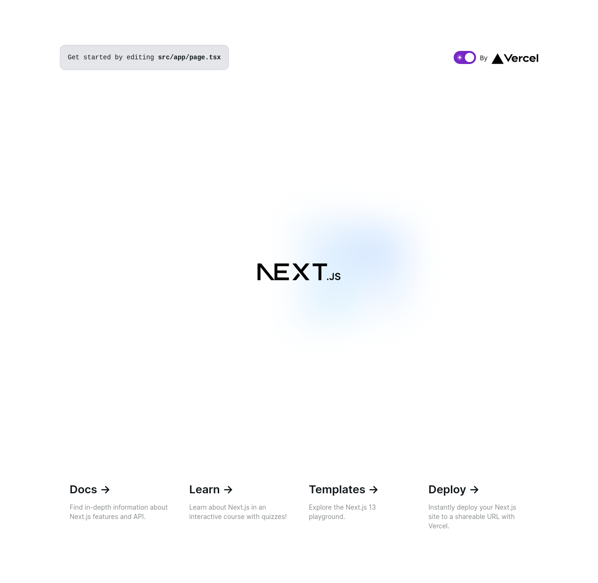

Ya tenemos Next instalado, pero ahora necesitamos integrar el resto de componentes que vamos a necesitar para trabajar.

## NextUI

Esta librería de componentes se apoya en TailwindCSS con lo que su instalación nos dará muy pocos problemas y viene bien descrita en la [web oficial](https://storiesv2.nextui.org/docs/frameworks/nextjs). En cualquier caso, vamos a instalarlo con el paquete `@heroicons/react`, que nos permitirá tener un paquete de iconos en la aplicación y con `next-themes` para poder aplicar tema oscuro o
claro.

```bash
npm install @nextui-org/react framer-motion @heroicons/react next-themes
```

Ahora necesitamos configurar el fichero de estilos de `tailwindcss` para que soporte los componentes de NextUI. De paso vamos a eliminar la clave theme porque es una personalización de la plantilla de Next.js que no vamos a necesitar.

```typescript title="tailwind.config.ts" hl_lines="1 9 11 12"
import { nextui } from '@nextui-org/react'
import type { Config } from 'tailwindcss'

const config: Config = {
  content: [
    './src/pages/**/*.{js,ts,jsx,tsx,mdx}',
    './src/components/**/*.{js,ts,jsx,tsx,mdx}',
    './src/app/**/*.{js,ts,jsx,tsx,mdx}',
    './node_modules/@nextui-org/theme/dist/**/*.{js,ts,jsx,tsx}',
  ],
  darkMode: 'class',
  plugins: [nextui()],
}
export default config
```

Y eliminamos los estilos que nos trae por defecto la plantilla de Next. Edita este archivo y deja solo
estas lineas:

```css title="src/app/globals.css"
@tailwind base;
@tailwind components;
@tailwind utilities;
```


### Dark theme

Para poder aplicar el tema oscuro o claro en nuestra aplicación, necesitamos configurar una librería llamada `next-theme`. En este caso NextUI también lo explica en la [web oficial](https://storiesv2.nextui.org/docs/customization/dark-mode).

Necesitamos, en cualquier caso crear un nuevo fichero con los providers de NextUI con el siguiente contenido:

```typescript title="src/app/providers.tsx"
'use client'

import { NextUIProvider } from '@nextui-org/react'
import { ThemeProvider as NextThemesProvider } from 'next-themes'

export function Providers({ children }: { children: React.ReactNode }) {
  return (
    <NextUIProvider>
      <NextThemesProvider attribute="class" defaultTheme="dark">
        {children}
      </NextThemesProvider>
    </NextUIProvider>
  )
}
```

!!! info
    La notación ```'use client'``` es exclusiva de algunos frameworks con soporte de `React Server Components`. Se verá su uso durante el curso.

Y este archivo de providers se debe cargar en el layout principal:

```typescript title="src/app/layout.tsx" hl_lines="6 23"
import './globals.css'

import type { Metadata } from 'next'
import { Inter } from 'next/font/google'

import { Providers } from './providers'

const inter = Inter({ subsets: ['latin'] })

export const metadata: Metadata = {
  description: 'Aplicación del taller de Next del Aula de Software Libre',
  title: 'Taller de Next con Typescript',
}

export default function RootLayout({
  children,
}: {
  children: React.ReactNode
}) {
  return (
    <html lang="en" className="dark">
      <body className={inter.className}>
        <Providers>{children}</Providers>
      </body>
    </html>
  )
}
```

### Nuestro primer componente: ThemeSwitcher

Para poder ver en funcionamiento el selector de tema claro/oscuro, vamos a crear un _switch_ para cambiar de un tema a otro.

Para eso crearemos el siguiente componente:

```typescript title="src/components/theme-switcher/theme-switcher.tsx"
'use client'

import { MoonIcon, SunIcon } from '@heroicons/react/24/solid'
import { Switch } from '@nextui-org/react'
import { useTheme } from 'next-themes'
import { useEffect, useState } from 'react'

/**
 * Theme dark/light switcher
 */
export function ThemeSwitcher() {
  const [mounted, setMounted] = useState(false)
  const { setTheme, theme } = useTheme()

  useEffect(() => {
    setMounted(true)
  }, [setMounted])

  if (!mounted) return null

  return (
    <Switch
      defaultSelected={theme === 'light'}
      size="md"
      color="secondary"
      onClick={() => setTheme(theme === 'dark' ? 'light' : 'dark')}
      startContent={<SunIcon />}
      endContent={<MoonIcon />}
    />
  )
}
```

1. Hook para comprobar si el componente ya ha sido montado.
2. Hook proporcionado por next-themes para conocer el tema y cambiarlo.
3. Esta función se ejecuta una sola vez, justo después de que el componente se haya montado, y cambia el estado del hook a _true_.

Y a continuación vamos a crear un fichero `index.ts` en ese directorio:

```typescript title="src/components/theme-switcher/index.ts"
export * from './theme-switcher'
```

!!! note

    En React, los componentes pueden organizarse de diferentes maneras. Pueden colocarse directamente en el directorio `components`; dentro de un directorio con el nombre del componente y en un archivo index.tsx o, como en el ejemplo, utilizando archivos `index.ts` para exportar componentes de manera centralizada. La elección depende del proyecto y las preferencias del equipo.
    

Vamos a probar a añadir nuestro componente a la pagina principal:

``` { .typescript .no-copy title="src/app/page.tsx" hl_lines="3 14" linenums="1" }
import Image from 'next/image'

import { ThemeSwitcher } from '@/components/theme-switcher'

export default function Home() {
  return (
    <main className="..">
      <div className="...">
        <p className="...">
          Get started by editing&nbsp;
          <code className="...">src/app/page.tsx</code>
        </p>
        <div className="fixed bottom-0 left-0 flex h-48 ...">
          <ThemeSwitcher /> // (1)!
          <a className="...">
            By{' '} 
            <Image src="/vercel.svg" alt="Vercel Logo"
               className="dark:invert" width={100} height={24} priority />
          </a>
        </div>
      </div>
```

1. Añadimos el componente antes del logo de Vercel. El IDE importará automáticamente el componente.

!!! warning

    En este caso no puedes copiar y pegar el código. Aprende a importar y usar
    componentes.

    Hay dos maneras de escribir una marca HTML. Si la marca tiene contenido:

    ```html
    <div>Content</div>
    ```

    Y si no lo tiene, como es el caso de nuestro componente:

    ```html
    <ThemeSwitcher />
    ```


Ahora, ya tendremos la página principal con nuestro componente para cambiar al tema claro:



