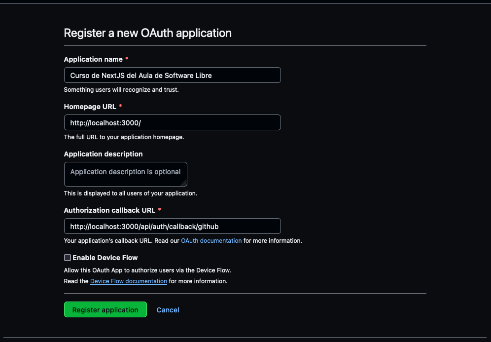

## Autenticación con Better Auth

En esta sección configuraremos Better Auth paso a paso utilizando GitHub como proveedor de autenticación y una base de datos SQLite local para almacenar las credenciales.

## Instalación

Instalamos las dependencias necesarias en el proyecto:

```bash
npm install better-auth better-sqlite3
npm install --save-dev @types/better-sqlite3
```

Vamos a usar SQLite con `better-sqlite3` porque es simple y no requiere instalar servidores adicionales. Si prefieres otro motor, puedes sustituirlo siguiendo la documentación oficial.

## Variables de entorno

Creamos (o actualizamos) el archivo `.env.local` con los valores que demanda Better Auth. La clave secreta se usa para encriptar y firmar cookies. Puedes generar una cadena aleatoria con cualquier herramienta (por ejemplo `openssl rand -base64 32`).

```env title=".env.local"
BETTER_AUTH_SECRET=pon_aqui_una_cadena_unica
BETTER_AUTH_URL=http://localhost:3000
NEXT_PUBLIC_APP_URL=http://localhost:3000
GITHUB_CLIENT_ID=tu_client_id_de_github
GITHUB_CLIENT_SECRET=tu_client_secret_de_github
```

`NEXT_PUBLIC_APP_URL` lo utilizamos en el cliente para construir la URL base cuando el proyecto se despliega en otro dominio.

El campo `BETTER_AUTH_URL` siempre debe apuntar a la URL pública de la aplicación (en local usaremos `http://localhost:3000`).

## Configurar Better Auth

Creamos el archivo `src/lib/auth.ts` con la instancia de Better Auth. En este ejemplo habilitamos el plugin `nextCookies` para que las cookies se sincronicen automáticamente en server actions y server components, configuramos SQLite y registramos el proveedor de GitHub.

```ts title="src/lib/auth.ts"
import { betterAuth } from 'better-auth'
import { nextCookies } from 'better-auth/next-js'
import Database from 'better-sqlite3'

export const auth = betterAuth({
  database: new Database('./better-auth.sqlite'),
  plugins: [nextCookies()],
  socialProviders: {
    github: {
      clientId: process.env.GITHUB_CLIENT_ID as string,
      clientSecret: process.env.GITHUB_CLIENT_SECRET as string,
    },
  },
})
```

La base de datos SQLite (`better-auth.sqlite`) se crea automáticamente en la raíz del proyecto cuando ejecutemos las migraciones.

## Crear las tablas

Better Auth incluye una CLI que genera el esquema y las migraciones necesarias. Desde la raíz del proyecto ejecutamos:

```bash
npx @better-auth/cli generate
npx @better-auth/cli migrate
```

El primer comando crea la migración y el segundo la aplica sobre nuestro archivo SQLite. Si utilizas otro motor o un ORM, revisa la documentación oficial para adaptar estos pasos.

## Ruta de API

Next.js necesita exponer un endpoint que procese las peticiones de autenticación. Creamos el archivo `src/app/api/auth/[...all]/route.ts` con el manejador oficial:

```ts title="src/app/api/auth/[...all]/route.ts"
import { toNextJsHandler } from 'better-auth/next-js'
import { auth } from '@/lib/auth'

export const { GET, POST } = toNextJsHandler(auth.handler)
```

Recomendamos mantener la ruta `/api/auth/[...all]`, ya que coincidimos con lo que espera la librería y con la configuración de GitHub.

## Registrar la aplicación en GitHub

Para permitir el login social necesitamos crear una OAuth App en GitHub:

1. Accedemos a [https://github.com/settings/developers](https://github.com/settings/developers).

2. Creamos una **OAuth App** con los siguientes valores en desarrollo:
    1. **Homepage URL**: `http://localhost:3000`
    1. **Authorization callback URL**: `http://localhost:3000/api/auth/callback/github`

    

3. Tras completar el formulario, GitHub nos mostrará el `Client ID`. Desde la misma pantalla generamos un nuevo `Client Secret`.

    

4. Copiamos ambos valores en `.env.local`.


!!! info
    Si recibes errores relacionados con el correo electrónico del usuario, revisa que tu GitHub App tenga el permiso *Email addresses* en modo lectura dentro de *Account permissions*.

## Cliente de Better Auth en React

El cliente nos ayuda a iniciar sesión desde componentes de React y a recuperar la sesión desde el navegador. Creamos `src/lib/auth-client.ts`:

```ts title="src/lib/auth-client.ts"
'use client'

import { createAuthClient } from 'better-auth/react'

export const authClient = createAuthClient({
  baseURL: process.env.NEXT_PUBLIC_APP_URL ?? 'http://localhost:3000',
})

export const { signIn, signOut, useSession } = authClient
```

Exportamos los métodos que utilizaremos en los componentes (`signIn`, `signOut`, `useSession`). Puedes añadir más helpers si los necesitas.

## Proteger páginas y obtener la sesión

Better Auth expone un API preparado para ejecutarse en componentes de servidor o server actions. En este ejemplo recuperamos la sesión dentro de una página del directorio `app` y redirigimos a los usuarios no autenticados:

```tsx title="src/app/dashboard/page.tsx"
import { headers } from 'next/headers'
import { redirect } from 'next/navigation'
import { auth } from '@/lib/auth'

export default async function DashboardPage() {
  const session = await auth.api.getSession({
    headers: await headers(),
  })

  if (!session) {
    redirect('/sign-in')
  }

  return <h1>Hola, {session.user.name ?? 'Usuario'}.</h1>
}
```

## Sign in desde el cliente

En el lado del cliente podemos llamar a `signIn.social` para abrir la ventana de GitHub. Crea, por ejemplo, un componente `LoginButton`:

```tsx title="src/components/login-button.tsx"
'use client'

import { CommandLineIcon } from '@heroicons/react/24/solid'
import { Button } from '@heroui/react'

import { signIn } from '@/lib/auth-client'

export function LoginButton() {
  return (
    <Button
      color="primary"
      onPress={() =>
        signIn.social({ provider: 'github', callbackURL: '/dashboard' })
      }
      startContent={<CommandLineIcon className="h-5 w-5" />}
      variant="solid"
    >
      Entrar con GitHub
    </Button>
  )
}
```

El cliente gestiona la apertura del flujo OAuth y, tras regresar de GitHub, refresca la sesión automáticamente.

## Página de inicio de sesión

Cuando redirigimos a `/sign-in` necesitamos una vista sencilla que invite al usuario a iniciar sesión con GitHub. Usaremos componentes de HeroUI y un icono de Heroicons para mantener la estética del curso. Crea el archivo `src/app/sign-in/page.tsx` con el siguiente contenido:

```tsx title="src/app/sign-in/page.tsx"
import { LockClosedIcon } from '@heroicons/react/24/solid'
import { Card, CardBody, CardHeader } from '@heroui/react'

import { LoginButton } from '@/components/login-button'

export default function SignInPage() {
  return (
    <div className="flex min-h-screen items-center justify-center bg-default-100">
      <Card className="w-[320px]">
        <CardHeader className="flex flex-col items-center gap-2 text-center">
          <LockClosedIcon className="h-8 w-8 text-primary" />
          <h1 className="font-semibold text-large">Necesitas iniciar sesión</h1>
        </CardHeader>
        <CardBody className="flex flex-col gap-4 text-center">
          <p className="text-default-500 text-sm">
            Usa tu cuenta de GitHub para continuar.
          </p>
          <LoginButton />
        </CardBody>
      </Card>
    </div>
  )
}
```

Esta página funciona como destino tanto para los usuarios que llegan de forma directa como para los que han sido redirigidos por el middleware. Al reutilizar `LoginButton` mantenemos la lógica en un único sitio.

## Middleware opcional

Si necesitas redirigir rápidamente desde el `middleware` de Next.js, puedes comprobar la existencia de la cookie de sesión utilizando el helper `getSessionCookie`. Ten en cuenta que esta verificación es optimista: siempre valida la sesión en el servidor antes de mostrar datos sensibles.

```ts title="src/middleware.ts"
import { NextRequest, NextResponse } from 'next/server'
import { getSessionCookie } from 'better-auth/cookies'

export function middleware(request: NextRequest) {
  const sessionCookie = getSessionCookie(request)

  if (!sessionCookie) {
    return NextResponse.redirect(new URL('/sign-in', request.url))
  }

  return NextResponse.next()
}

export const config = {
  matcher: ['/dashboard'],
}
```

### Validación completa en cada página

La forma segura de proteger rutas es verificar la sesión dentro de la propia página o en la acción del servidor que vaya a ejecutar lógica sensible (como hicimos en el ejemplo anterior con `auth.api.getSession`).

## Resumen

1. Instalamos `better-auth` y configuramos una base de datos (en este curso usamos SQLite).
2. Creamos un archivo `auth.ts` con la instancia, habilitamos GitHub como proveedor social y registramos el plugin `nextCookies`.
3. Configuramos la ruta `/api/auth/[...all]` con `toNextJsHandler`.
4. Registramos la aplicación en GitHub y añadimos las credenciales en `.env.local`.
5. Creamos un cliente (`auth-client.ts`) para iniciar sesión desde componentes.
6. Añadimos la página `/sign-in` reutilizando `LoginButton` para ofrecer el acceso social.
7. Protegemos páginas recuperando la sesión con `auth.api.getSession`.

Con estos pasos ya tenemos autenticación social con GitHub funcionando en nuestro proyecto Next.js usando Better Auth.
