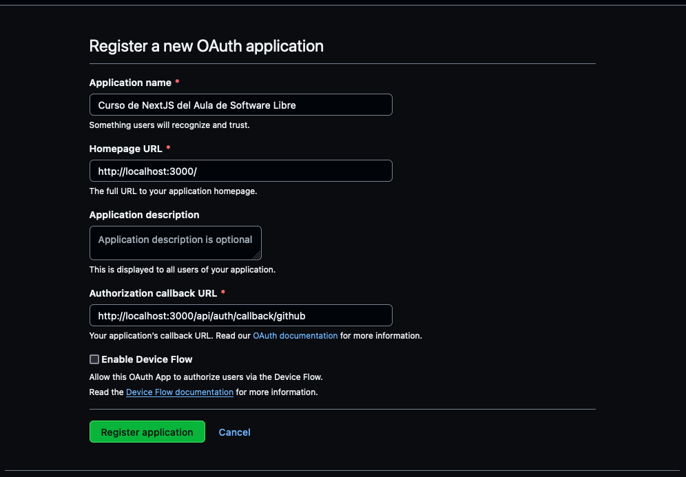
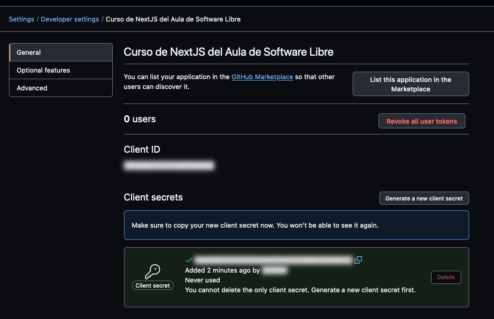

NextAuth.js es una librería de autenticación que se integra fácilmente con aplicaciones web basadas en Next.js. Esta potente librería simplifica la implementación de la autenticación de usuarios, incluyendo la autenticación social y el manejo de sesiones. Con NextAuth.js, puedes configurar la autenticación de manera eficiente y segura, permitiendo a los usuarios acceder a tus aplicaciones de forma sencilla a través de múltiples proveedores, como Google, Facebook, GitHub y más.

## Instalación

Lo primero es instalar el paquete, como siempre:

```bash
npm install next-auth
```

Y a continuación creamos el fichero de configuración:

```ts title="src/app/api/auth/[...nextauth]/route.ts"
import NextAuth, { NextAuthOptions } from 'next-auth'
import GithubProvider from 'next-auth/providers/github'

export const config: NextAuthOptions = {
  providers: [
    clientId: process.env.GITHUB_ID || '',
    clientSecret: process.env.GITHUB_SECRET || '',
],
  secret: process.env.NEXTAUTH_SECRET,
}

const handler = NextAuth(config)

export { handler as GET, handler as POST }
```

Y activamos el middleware que se encarga de garantizar que todas las llamadas a Next
son seguras:

```ts title="src/middleware.ts"
export { default } from 'next-auth/middleware'

export const config = { matcher: ['/counter'] }
```

!!! info
    Por defecto el middleware asegura todas los accesos. Con `matcher` podemos restringir
    qué rutas queremos proteger. Para este ejemplo solo vamos a asegurar nuestro contador.

    Mira la documentación de [middleware en next](https://nextjs.org/docs/app/building-your-application/routing/middleware) para saber como funciona `matcher`.


En este fichero registraremos que proveedores de identidad queremos usar, en el
ejemplo usaremos GitHub, pero podemos usar muchísimos mas (Google, Spotify, Twitter,...).

Ahora necesitamos poder leer la sesión del usuario cuando esta logueado. NextAuth
nos da una función, pero como requiere pasarle un parámetro vamos a crear una propia
que nos ahorre trabajo cada vez que la queremos usar:

```ts title="src/lib/next/auth.ts"
import type {
  GetServerSidePropsContext,
  NextApiRequest,
  NextApiResponse,
} from 'next'
import { getServerSession } from 'next-auth'

import { config } from '@/app/api/auth/[...nextauth]/route'

export function auth(
  ...args:
    | [GetServerSidePropsContext['req'], GetServerSidePropsContext['res']]
    | [NextApiRequest, NextApiResponse]
    | []
) {
  return getServerSession(...args, config)
}
```

## Registro de nuestra aplicación en Github

Para que podamos hacer login usando Github, necesitamos registrar una aplicación
OAuth. Para ello nos iremos a la web de registro de aplicaciones OAuth:
[https://github.com/settings/applications/new](https://github.com/settings/applications/new)

Necesitamos tres datos:

* **Application name**: El que queramos, por ejemplo: `Curso de NextJS del Aula de Software Libre`
* **Homepage URL**: Esta sería la url de nuestra web si estuviera publicada, por ahora usaremos: `http://localhost:3000/`
* **Authorization callback URL**: Esta es la url de NextAuth que finalizará el proceso de autenticación, debemos poner: `http://localhost:3000/api/auth/callback/github`




Una vez eso ya tendremos el primero de los dos datos que necesitamos el `GITHUB_ID`, es la cadena hexadecimal que 
aparece en la web de la aplicación. A continuación debemos pulsar a `Generate a new client secret` para
conseguir el segundo dato necesario `GITHUB_SECRET`




Y por último vamos a crear un archivo de credenciales donde guardar esos datos:

```env title=".env.local"
GITHUB_ID=tu Client ID de la web de Github
GITHUB_SECRET=tu Client Secret de la web de Github
NEXTAUTH_URL=http://localhost:3000/api/auth
NEXTAUTH_SECRET=CHANGE_ME
```

!!! info
    Recuerda que las credenciales son secretas, nunca las subas a Github.
    El fichero `.env.local` está en el `.gitignore` así que no tienes que preocuparte.

## Acceso a la web asegurara

Si intentamos acceder ahora a nuestro contador, veremos que nos saltará la página
para loguearnos en Github. Solo si nos identificamos podremos verla.

Para conseguir ver los datos del usuario es tan facil como hacer lo siguiente en cualquier 
lugar donde lo necesitemos:

```ts
import { Session } from 'next-auth'

import { auth } from '@/lib/next/auth'

export default async function Page() {
  const session: Session | null = await auth()

  // Podemos ver en la consola de NextJS todos los datos del servidor
  console.table(session)

  if (!session) {
    return <>Unauthorized</>
  }

  const { user: { name } = {} } = session

  return <>Hello, {name}.</>
}
```

## Ampliar datos de la sesión

En ocasiones necesitamos saber más datos provenientes del proveedor de identidad. Uno
de ellos es el `id`, que no viene. Vamos a añadirlo.

Modificamos nuestra configuración:

```ts title="src/app/api/auth/[...nextauth]/route.ts" hl_lines="5-11"
import NextAuth, { NextAuthOptions } from 'next-auth'
import GithubProvider from 'next-auth/providers/github'

export const config: NextAuthOptions = {
  callbacks: {
    async session({ session, token }) {
      session.user.id = token.sub

      return session
    },
  },
  providers: [
    GithubProvider({
      clientId: process.env.GITHUB_ID || '',
      clientSecret: process.env.GITHUB_SECRET || '',
    }),
  ],
  secret: process.env.NEXTAUTH_SECRET,
}

const handler = NextAuth(config)

export { handler as GET, handler as POST }
```

Estamos añadiendo un campo extra, desgraciadamente ese campo no existe en el interfaz
de usuario original, pero podemos ampliarlo. Esta técnica se llama interface augmention.
Creamos el siguiente fichero:

```ts title="src/types/next-auth.d.ts"
import { DefaultSession } from 'next-auth'

declare module 'next-auth' {
  interface Session {
    user: {
      id?: string | null
    } & DefaultSession['user']
  }
}
```

Y ya el interprete de Typescript debe dejar de dar error porque el campo id no existe.
