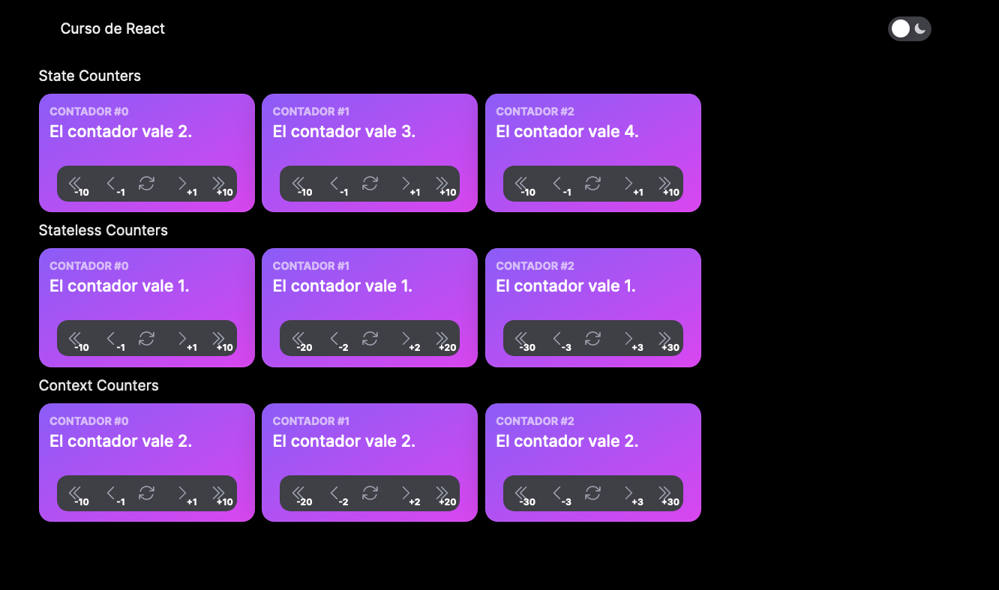

En esta sección, exploraremos cómo utilizar la Context API de React para pasar datos de manera eficiente a través de múltiples componentes en una aplicación. La Context API es una herramienta poderosa que nos permite compartir datos a nivel global en nuestra aplicación, evitando la necesidad de pasar propiedades manualmente a través de componentes intermedios. Descubriremos cómo crear y consumir contextos, lo que nos permitirá simplificar la comunicación entre componentes y mejorar la mantenibilidad de nuestro código React.

Un contexto en React consta generalmente de tres partes clave:

1. **Proveedor de Contexto (Context Provider)**: Este componente es responsable de proporcionar los datos y las funciones que deseas compartir a lo largo de la aplicación. En este caso, el proveedor de contexto contendrá el valor del contador y las dos funciones asociadas (resetear y aumentar).

2. **Consumidor de Contexto (Context Consumer)**: Los componentes que deseen acceder a los datos almacenados en el contexto deben consumirlo. El consumidor es responsable de acceder y utilizar los datos proporcionados por el proveedor de contexto.

3. **Contexto en sí (Context)**: El contexto en sí mismo es el objeto que contiene los datos y las funciones que se comparten entre componentes. Es la pieza central que conecta al proveedor y al consumidor.

## Contexto básico

Este archivo define los tipos de datos relacionados con el contexto del contador. Define una interfaz `CounterState` que incluye un campo `counter` que representa el valor del contador y una función `setCounter` que se utiliza para actualizar ese valor:

```ts title="src/state/CounterProvider/types.ts"
export type CounterState = {
  counter: number
  setCounter: (value: number) => void
}
```

!!! warning

    Nuestro CounterProvider va a compartir tanto el estado (counter) como la función que lo modifica (setCounter). Si bien esta implementación puede ser adecuada en situaciones simples, puede no ser óptima en casos más complejos.

    Cuando se utiliza un contexto para compartir tanto el estado como la función de modificación, cualquier cambio en el estado (incluso si no se modifica) causará que todos los componentes que consumen ese contexto se vuelvan a renderizar. Al separar el estado y la función de modificación en dos contextos diferentes, puedes evitar re-renders innecesarios y mejorar el rendimiento.

    Por el momento lo haremos así y en la sección siguiente los separaremos.

En este archivo, se utiliza la función `createContext` de React para crear el contexto. Se crea un contexto llamado `CounterStateContext` que inicialmente se establece como `undefined`. Este contexto actuará como un contenedor para los datos y las funciones relacionadas con el contador:

```ts title="src/state/CounterProvider/context.ts"
import { createContext } from 'react'

import { CounterState } from './types'

export const CounterStateContext = createContext<CounterState | undefined>(
  undefined,
)
```

El componente `CounterProvider` es el proveedor de contexto. Utiliza el hook `useState` para crear y mantener el estado del contador, con un valor inicial de 0. Luego, utiliza el contexto `CounterStateContext.Provider` para proporcionar el valor del contador y la función `setCounter` a cualquier componente descendiente que consuma este contexto.

```ts title="src/state/CounterProvider/CounterProvider.tsx"
import { useState } from 'react'

import { CounterStateContext } from './context'

export default function CounterProvider({
  children,
}: {
  children: React.ReactNode
}) {
  const [counter, setCounter] = useState(0)

  return (
    <CounterStateContext.Provider value={{ counter, setCounter }}>
      {children}
    </CounterStateContext.Provider>
  )
}
```

Este archivo contiene un hook personalizado llamado useCounter. Este hook se utiliza para consumir el contexto `CounterStateContext` y proporciona una interfaz para acceder al valor del contador y las funciones de incremento y reinicio. Si se utiliza fuera del contexto del proveedor, arrojará un error para asegurarse de que se utilice correctamente.

```ts title="src/state/CounterProvider/hooks.ts"
import { useCallback, useContext } from 'react'

import { CounterStateContext } from './context'

export const useCounter = () => {
  const state = useContext(CounterStateContext)

  if (state === undefined) {
    throw new Error('useCounter must be used within a CounterProvider')
  }

  const { counter, setCounter } = state

  const onIncrement = useCallback(
    (amount: number) => setCounter(counter + amount),
    [counter, setCounter],
  )

  const onReset = useCallback(() => setCounter(0), [setCounter])

  return {
    counter,
    onIncrement,
    onReset,
  }
}
```

Este archivo exporta el `CounterProvider` y el hook `useCounter`, lo que facilita su importación en otros archivos de la aplicación sin tener que preocuparse por las rutas de los archivos.

```ts title="src/state/CounterProvider/index.ts"
export { default } from './CounterProvider'
export { useCounter } from './hooks'
```

## Carga del contexto

Necesitamos utilizar el contexto, lo podemos hacer en el `src/app/providers.tsx`
si queremos que sea común a toda la aplicación o podemos usarlo en una página.
Es lo que vamos a hacer. Actualizamos el fichero `src/app/counter/layout.tsx`.

```ts title="src/app/counter/layout.tsx"
'use client'

import Menu from '@/components/Menu'
import CounterProvider from '@/state/CounterProvider'

export default function CounterLayout({
  children,
}: {
  children: React.ReactNode
}) {
  return (
    <CounterProvider>
      <div className="container mx-auto">
        <div className="flex flex-col gap-2">
          <Menu />
          <div>{children}</div>
        </div>
      </div>
    </CounterProvider>
  )
}
```

## Uso del custom hook

Ahora tenemos un custom hook que podemos usar como usabamos `useState`. Vamos
a hacer un ejemplo rápido con `StatelessCounter`. Podemos ver como nuestro hook
nos proporciona el estado y los métodos que lo actualizan:

```ts title="src/components/CounterContainerContext/CounterContainerContext.tsx"
'use client'

import { useCounter } from '@/state/CounterProvider'

import StatelessCounter from '../StatelessCounter'

export default function CounterContainerContext() {
  const { counter, onIncrement, onReset } = useCounter()

  return (
    <div className="flex flex-row gap-2">
      {Array.from({ length: 3 }, (_, id) => (
        <StatelessCounter
          key={id}
          id={id}
          step={id + 1}
          counter={counter}
          onIncrement={onIncrement}
          onReset={onReset}
        />
      ))}
    </div>
  )
}
```

```ts title="src/components/CounterContainerContext/index.tsx"
export { default } from './CounterContainerContext'
```

!!! question "Ejercicio"

    Puedes crear un nuevo componente ContextCounter que use internamente `useCounter`
    como el original usaba `useState`. Sería similar a nuestro primer componente Counter, de hecho usaría el mismo contrato:

    ```ts title="src/components/ContextCounter/types.ts"
    export interface CounterProps {
      id: number
      step: number
    }
    ```

Y por último cargamos nuestros contadores en la página:

```ts title="src/app/counter/page.tsx"
import Counter from '@/components/Counter'
import CounterContainerContext from '@/components/CounterContainerContext'
import CounterContainerShared from '@/components/CounterContainerShared'

export default function CounterPage() {
  return (
    <div className="flex flex-col gap-2">
      <h2>State Counters</h2>
      <div className="flex flex-row gap-2">
        {Array.from({ length: 3 }, (_, id) => (
          <Counter key={id} id={id} step={1} />
        ))}
      </div>
      <h2>Stateless Counters</h2>
      <CounterContainerShared />
      <h2>Context Counters</h2>
      <CounterContainerContext />
    </div>
  )
}
```

## Conclusión

Por el momento hemos visto tres formas distintas de manejar estados, dependiendo
de nuestras necesidades usaremos uno u otro. Debemos intentar usar siempre el
más sencillo. Si el estado no se necesita compartir masivamente no es necesario
crear un contexto.



