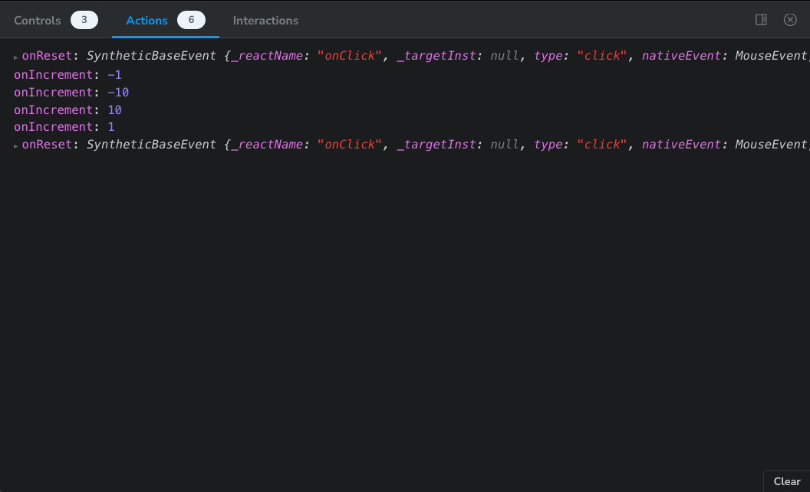
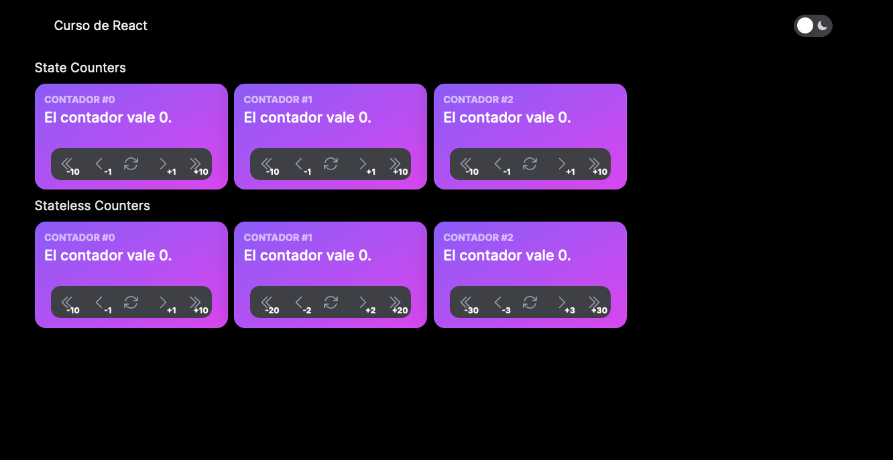

Vamos a imaginar un nuevo caso de uso donde queramos compartir el mismo estado
entre diferentes componentes. En este caso, lo que interesa es que nuestros
componentes sean sin estado (_stateless_). En el caso de nuestro contador
eso significa que al no poder usar hooks, tanto `counter` como `setCounter`
viven fuera de nuestro componente y tanto el valor como los handlers vienen
dados como argumentos.

!!! info
    Recuerda que esto no son casos reales, solo ejemplos de cómo aplicar
    distintos patrones.

Para ello vamos a crear un nuevo componente llamado `StatelessCounter` para
evitar perder el trabajo que teníamos hecho.

## Componente StatelessCounter

Ahora nuestro componente tiene más propiedades, a las que ya tenía `Counter`
tenemos que pasarle el valor actual del contador, una función que se llamará para
indicar que queremos resetear el contador, y otra para indicar que queremos cambiar
en un valor dado el contador.

```ts hl_lines="4-6"
interface StatelessCounterProperties {
  id: number
  step: number
  counter: number
  onIncrement: (amount: number) => void
  onReset: () => void
}
```

Este sería el componente completo, si te fijas, hemos cambiado `setCounter`
por nuestras funciones:


```ts title="src/components/counter/stateless-counter.tsx"
'use client'

import {
  ArrowPathIcon,
  ChevronDoubleLeftIcon,
  ChevronDoubleRightIcon,
  ChevronLeftIcon,
  ChevronRightIcon,
} from '@heroicons/react/24/outline'
import {
  Button,
  ButtonGroup,
  Card,
  CardFooter,
  CardHeader,
} from '@heroui/react'

interface StatelessCounterProperties {
  counter: number
  id: number
  onIncrement: (amount: number) => void
  onReset: () => void
  step: number
}

export function StatelessCounter({
  counter,
  id,
  onIncrement,
  onReset,
  step,
}: StatelessCounterProperties) {
  return (
    <Card className="w-60 bg-linear-to-br from-violet-500 to-fuchsia-500">
      <CardHeader className="items-start! flex-col">
        <div className="flex flex-col">
          <p className="font-bold text-tiny text-white/60 uppercase">
            Contador #{id}
          </p>
          <p className="font-medium text-large text-white">
            El contador vale {counter}.
          </p>
        </div>
      </CardHeader>
      <CardFooter className="justify-center">
        <ButtonGroup>
          <Button
            aria-label="Decrement counter with step"
            isIconOnly
            onPress={() => onIncrement(-step * 10)}
            size="md"
          >
            <ChevronDoubleLeftIcon
              className="text-gray-600 dark:text-gray-400"
              height="1.3rem"
            />
            <div className="absolute right-1 bottom-0 font-bold text-[10px]">
              -{step * 10}
            </div>
          </Button>
          <Button
            aria-label="Decrement counter"
            isIconOnly
            onPress={() => onIncrement(-step)}
            size="md"
          >
            <ChevronLeftIcon
              className="text-gray-600 dark:text-gray-400"
              height="1.3rem"
            />
            <div className="absolute right-1 bottom-0 font-bold text-[10px]">
              -{step}
            </div>
          </Button>
          <Button
            aria-label="Reset counter"
            isIconOnly
            onPress={onReset}
            size="md"
          >
            <ArrowPathIcon
              className="text-gray-600 dark:text-gray-400"
              height="1.3rem"
            />
          </Button>
          <Button
            aria-label="Increment counter"
            isIconOnly
            onPress={() => onIncrement(step)}
            size="md"
          >
            <ChevronRightIcon
              className="text-gray-600 dark:text-gray-400"
              height="1.3rem"
            />
            <div className="absolute right-1 bottom-0 font-bold text-[10px]">
              +{step}
            </div>
          </Button>
          <Button
            aria-label="Increment counter with step"
            isIconOnly
            onPress={() => onIncrement(step * 10)}
            size="md"
          >
            <ChevronDoubleRightIcon
              className="text-gray-600 dark:text-gray-400"
              height="1.3rem"
            />
            <div className="absolute right-1 bottom-0 font-bold text-[10px]">
              +{step * 10}
            </div>
          </Button>
        </ButtonGroup>
      </CardFooter>
    </Card>
  )
}
```

Y por último la historia:

```ts title="src/stories/components/stateless-counter.stories.ts"
import type { Meta, StoryObj } from '@storybook/nextjs'
import { fn } from 'storybook/test'
import { StatelessCounter } from '@/components/counter/stateless-counter'

const meta = {
  component: StatelessCounter,
  parameters: {
    layout: 'centered',
  },
  title: 'Components/StatelessCounter',
  args: {
    onIncrement: fn(),
    onReset: fn(),
  },
} satisfies Meta<typeof StatelessCounter>

export default meta
type Story = StoryObj<typeof meta>

export const Basic: Story = {
  args: {
    counter: 0,
    id: 1,
    step: 1,
  },
}
```

Si nos vamos al panel de Storybook, ahora veremos que el contador como tal no
funciona, obvio porque no tiene estado. Sin embargo si pulsamos algún botón
veremos que la pestaña actions refleja las acciones que se ejecutan en el handler:



## Pasar el estado entre componentes

Ahora ya podemos crear el estado del contador y pasarlo como argumento. Pero no
es buena idea que el estado esté en la propia `CounterPage`, porque en la nueva
versión de Next perderíamos la propiedad de que esa página fuera un Server
React Component.

Es mejor crear un componente que contenga a nuestros contadores sin estado:

```ts title="src/components/counter/stateless-counter-container.tsx"
'use client'

import { useCallback, useState } from 'react'

import { StatelessCounter } from './stateless-counter'

export function StatelessCounterContainer() {
  const [counter, setCounter] = useState(0)

  const onIncrement = useCallback(
    (amount: number) => setCounter(counter + amount),
    [counter]
  )

  const onReset = useCallback(() => setCounter(0), [])

  return (
    <div className="flex flex-row gap-2">
      <StatelessCounter
        counter={counter}
        id={1}
        onIncrement={onIncrement}
        onReset={onReset}
        step={1}
      />
      <StatelessCounter
        counter={counter}
        id={2}
        onIncrement={onIncrement}
        onReset={onReset}
        step={2}
      />
      <StatelessCounter
        counter={counter}
        id={3}
        onIncrement={onIncrement}
        onReset={onReset}
        step={5}
      />
    </div>
  )
}
```


Y añadimos el componente a nuestra página:


```ts title="src/app/counter/page.tsx"
import { CounterContainer } from '@/components/counter/counter-container'
import { StatelessCounterContainer } from '@/components/counter/stateless-counter-container'

export default function CounterPage() {
  return (
    <div className="flex flex-col gap-2">
      <h2>State Counters</h2>
      <div className="flex flex-row gap-2">
        <CounterContainer />
      </div>
      <h2>Stateless Counters</h2>
      <div className="flex flex-row gap-2">
        <StatelessCounterContainer />
      </div>
    </div>
  )
}
```


## Conclusión

Ahora podemos ver dos filas de componentes, la primera no comporten estado
y la segunda sí. Usar una u otra dependerá de nuestro caso de uso. Por lo general
no habrá muchas situaciones en las que tengamos que crear componentes sin estado.



Para aquellos casos en los que necesitemos compartirlo, veremos que probablemente
lo necesitemos en distintos puntos del documento que no estén próximos entre sí.
Si ese fuera el caso, o se usa [composición](https://legacy.reactjs.org/docs/composition-vs-inheritance.html)
si es posible, o necesitamos usar contextos, que veremos en la siguiente sección.
