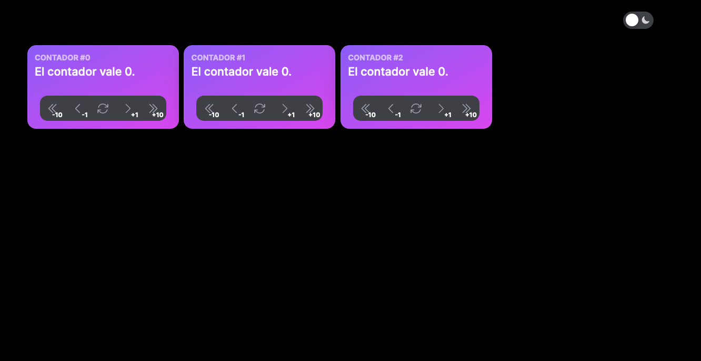

## Gestionar el estado dentro del componente

El hook `useState` en React permite gestionar el estado local de un componente funcional. Al utilizar `useState`, podemos declarar variables de estado y realizar actualizaciones en respuesta a eventos o acciones del usuario. El hook consta de dos partes: el valor actual del estado y una función para actualizar ese valor. Cuando llamamos a la función de actualización, React re-renderiza el componente con el nuevo estado, lo que proporciona una experiencia dinámica y reactiva en nuestras aplicaciones. En esta sección, exploraremos cómo utilizar `useState` para mantener y actualizar el estado interno de nuestros componentes de manera efectiva.

Los hooks **siempre** deben aparecer al comienzo de las funciones donde se declaran.
Por lo tanto, vamos a añadir la siguiente línea al principio de la función Counter,
sustituyendo a la variable counter así:

```ts
import { useState } from 'react'

export default function Counter({ id, step }: CounterProps) {

  const [counter, setCounter] = useState(0)
```

Y ahora podemos usar la función setCounter para actualizar el valor de counter.
Por ejemplo modificamos el botón de incrementar el contados añadiendo a la 
propiedad _onClick_ una función que al ser ejecutada incremente el valor de counter.


```ts hl_lines="3"
<Button 
  isIconOnly size="md" aria-label="Increment counter"
  onClick={() => setCounter(counter + step)}
>
  <ChevronRightIcon
    className="text-gray-600 dark:text-gray-400"
    height="1.3rem"
  />
  <div className="absolute right-1 bottom-0 font-bold text-[10px]">
    +{step}
  </div>
</Button>
```

!!! info
    Es importante entender que los estados son inmutable, o deben tratarse
    como si lo fueran. Si queremos modificarlos debemos usar siempre la función
    set proporcionada. De lo contrario React no sabrá que tiene que volver
    a renderizar el componente.

Ahora al pulsado el botón de incrementar el contador veremos que ya funciona 
correctamente.

!!! question "Ejercicio"
    Completa el resto de acciones de los botones de incrementar y decrementar por
    pasos y de reiniciar el contador a cero.

## Visualizar el componente en la aplicación Next

Hasta ahora hemos usado Storybook para visualizar los componentes, vamos a crear
nuestra primera página para usarlo allí. 

Vamos a crear los siguientes archivos.

### Componente Menu

```ts title="src/components/Menu/Menu.tsx"
'use client'

import { Navbar, NavbarBrand, NavbarContent } from '@nextui-org/react'

import ThemeSwitcher from '@/components/ThemeSwitcher'

export default function Menu() {
  return (
    <Navbar position="static">
      <NavbarBrand>Curso de React</NavbarBrand>
      <NavbarContent justify="end">
        <ThemeSwitcher />
      </NavbarContent>
    </Navbar>
  )
}
```

!!! question "Ejercicio"
    Crea el fichero `index.ts` para este componente como hicimos con el `ThemeSwitcher`. Recuerda que es un convenio de este proyecto y que en otros que te encuentres puede no ser necesario.


### Componente CounterLayout

```ts title="src/app/counter/layout.tsx"
'use client'

import Menu from '@/components/Menu'

export default function CounterLayout({
  children,
}: {
  children: React.ReactNode
}) {
  return (
    <div className="container mx-auto">
      <div className="flex flex-col gap-2">
        <Menu />
        <div>{children}</div>
      </div>
    </div>
  )
}
```

### Componente CounterPage

```ts title="src/app/counter/page.tsx"
import Counter from '@/components/Counter'

export default function CounterPage() {
  return (
    <div className="flex flex-row gap-2">
      {Array.from({ length: 3 }, (_, id) => (
        <Counter key={id} id={id} step={1} />
      ))}
    </div>
  )
}
```

Y ahora debes tener disponible una nueva página `/counter` con tres contadores en
[http://localhost:3000/counter](http://localhost:3000/counter) y con un menú.



!!! info
    Los layout reciben un parámetro children que es la combinación de todos los
    layouts de los directorios superiores más la página superior. Es decir, que
    lo que se está renderizando es equivalente a:

    ```html
    <RootLayout> // Este el layout en src/app/layout.tsx
      <CounterLayout>
        <CounterPage />
      </CounterLayout>
    </RootLayout>
    ```

    Es muy útil para heredar plantillas entre subrutas. Más información en
    [la documentación de Next](https://nextjs.org/docs/app/building-your-application/routing/pages-and-layouts).


### Conclusión

Si pruebas los tres componentes, verás que cada uno tiene su propio estado y que
no se comparten entre ellos. Es decir, si incrementas uno, el resto queda como estaba.
