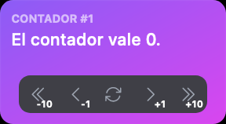

En este capítulo, exploraremos las técnicas fundamentales de gestión de estado en React utilizando el hook useState y la Context API. Aprenderemos cómo utilizar useState para administrar el estado local de un componente y cómo compartir ese estado entre varios componentes a través de la composición y el contexto. Descubriremos las ventajas y consideraciones de cada enfoque para tomar decisiones informadas sobre cómo gestionar eficazmente el estado en nuestras aplicaciones React.

## Componente contador

Para este capítulo vamos a usar un componente nuevo llamado `Counter`. Vamos a crear el componente del contador, un fichero con los tipos o propiedades que usa y el fichero con su Story:

```ts title="src/components/counter/types.ts"
export interface CounterProperties {
  id: number
  step: number
}
```

```ts title="src/components/counter/counter.tsx"
'use client' // (1)!

import {
  ArrowPathIcon,
  ChevronDoubleLeftIcon,
  ChevronDoubleRightIcon,
  ChevronLeftIcon,
  ChevronRightIcon,
} from '@heroicons/react/24/outline'
import {
  Button,
  ButtonGroup,
  Card,
  CardFooter,
  CardHeader,
} from '@nextui-org/react'

import { CounterProperties } from './types'

export function Counter({ id, step }: CounterProperties) {
  const counter = 0

  return (
    <Card className="w-[240px] bg-gradient-to-br from-violet-500 to-fuchsia-500">
      <CardHeader className="flex-col items-start">
        <div className="flex flex-col">
          <p className="text-tiny text-white/60 uppercase font-bold">
            Contador #{id}
          </p>
          <p className="text-white font-medium text-large">
            El contador vale {counter}.
          </p>
        </div>
      </CardHeader>
      <CardFooter className="justify-center">
        <ButtonGroup>
          <Button
            isIconOnly
            size="md"
            aria-label="Decrement counter with delay"
          >
            <ChevronDoubleLeftIcon
              className="text-gray-600 dark:text-gray-400"
              height="1.3rem"
            />
            <div className="absolute right-1 bottom-0 font-bold text-[10px]">
              -{step * 10}
            </div>
          </Button>
          <Button isIconOnly size="md" aria-label="Decrement counter">
            <ChevronLeftIcon
              className="text-gray-600 dark:text-gray-400"
              height="1.3rem"
            />
            <div className="absolute right-1 bottom-0 font-bold text-[10px]">
              -{step}
            </div>
          </Button>
          <Button isIconOnly size="md" aria-label="Reset counter">
            <ArrowPathIcon
              className="text-gray-600 dark:text-gray-400"
              height="1.3rem"
            />
          </Button>
          <Button isIconOnly size="md" aria-label="Increment counter">
            <ChevronRightIcon
              className="text-gray-600 dark:text-gray-400"
              height="1.3rem"
            />
            <div className="absolute right-1 bottom-0 font-bold text-[10px]">
              +{step}
            </div>
          </Button>
          <Button
            isIconOnly
            size="md"
            aria-label="Increment counter with delay"
          >
            <ChevronDoubleRightIcon
              className="text-gray-600 dark:text-gray-400"
              height="1.3rem"
            />
            <div className="absolute right-1 bottom-0 font-bold text-[10px]">
              +{step * 10}
            </div>
          </Button>
        </ButtonGroup>
      </CardFooter>
    </Card>
  )
}
```

1. Recordemos que esta línea es obligatoria cuando se use un router con soporte de React Server Components, como es el caso de la nueva versión de Next, y el componente use hooks.

```ts title="src/components/counter/index.ts"
export * from './Counter'
```


```ts title="stories/components/counter.stories.ts"
import { Meta, StoryObj } from '@storybook/react'

import { Counter } from '@/components/Counter'

const meta = {
  component: Counter,
  title: 'Components/Counter',
} satisfies Meta<typeof Counter>

export default meta
type Story = StoryObj<typeof meta>

export const Basic: Story = {
  args: {
    id: 1,
    step: 1,
  },
}
```

Si visitamos ahora el componente en Storybook veremos lo siguiente:


