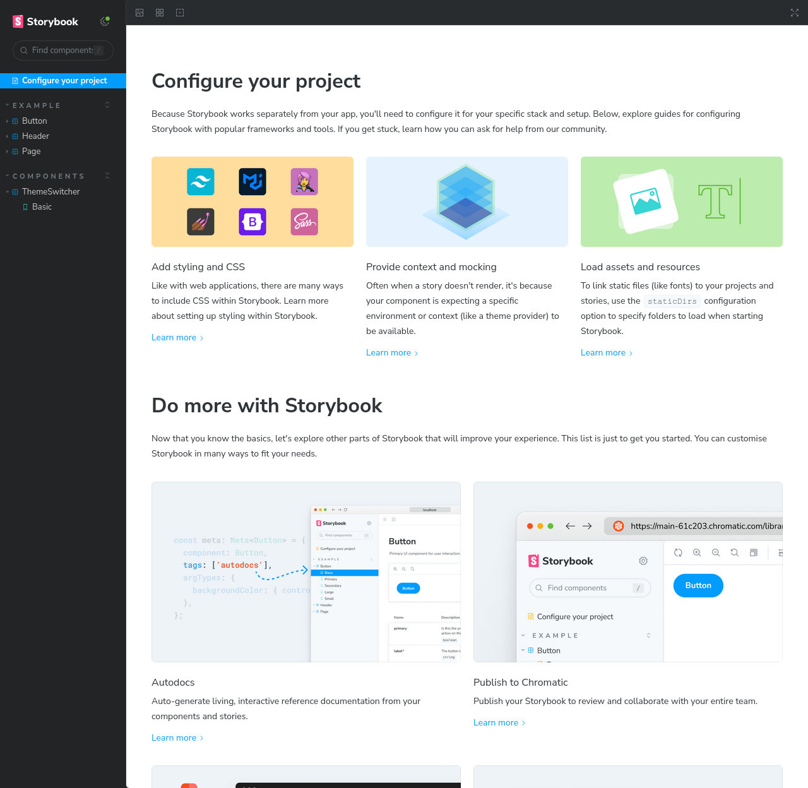
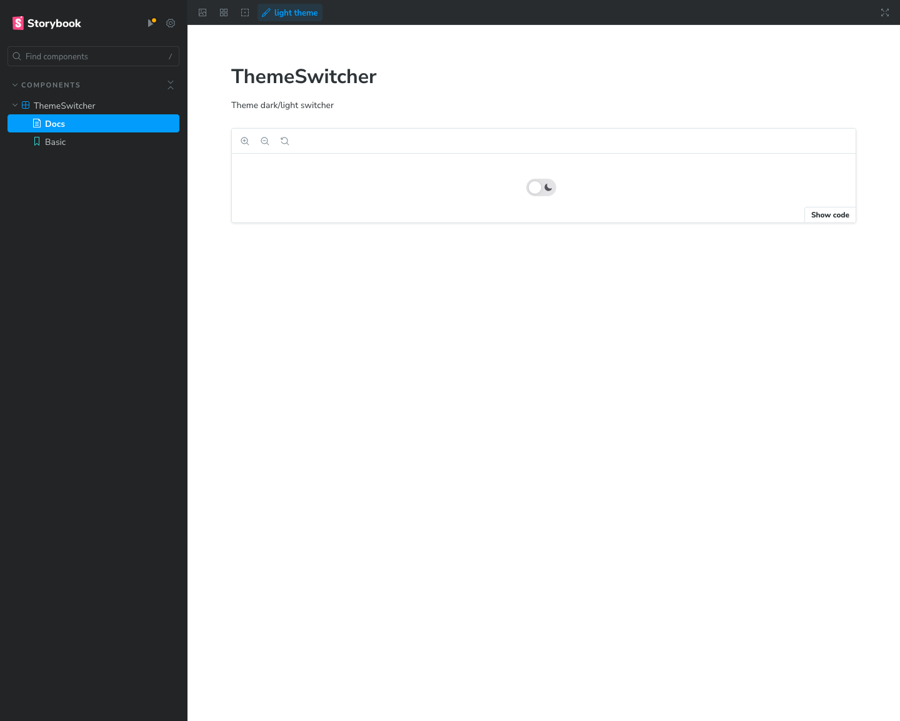

Storybook es una herramienta sumamente valiosa en el desarrollo de aplicaciones, ya que permite la visualización y exploración de componentes de forma aislada, lo que significa que puedes ver y probar un componente específico sin tener que ejecutar toda la aplicación. Esto resulta extremadamente útil durante el proceso de desarrollo, ya que te permite concentrarte en la construcción y refinamiento de componentes individuales de manera eficiente, sin la necesidad de navegar por la aplicación en su totalidad.

Además de su capacidad para facilitar el desarrollo y la depuración de componentes, Storybook es también una herramienta clave para la creación de un "design system" o sistema de diseño. Un "design system" es un conjunto cohesivo de principios de diseño, componentes reutilizables y directrices de estilo que garantizan la coherencia visual y de interacción en toda la aplicación. Storybook es un lugar ideal para compilar y documentar estos componentes y sus variaciones, lo que permite a los diseñadores y desarrolladores colaborar de manera efectiva para definir y mantener un diseño consistente en toda la aplicación. En resumen, Storybook no solo simplifica el proceso de desarrollo y pruebas, sino que también sirve como una herramienta fundamental en la creación y gestión de un sistema de diseño sólido y coherente.

Sin embargo, no suele ser sencillo de configurar. Aunque la herramienta de instalación que proporciona suele reconocer el framework, normalmente no es capaz de reconocer los temas que utilizamos o ciertas configuraciones de typescript como las rutas.

## Instalación

En vez de dirigirnos a la web principal, vamos a indicar los pasos a seguir. Lo primero es instalar storybook dentro de nuestro proyecto. Nos preguntará si
queremos usar el plugin de eslint, le diremos que sí.

```bash
npx storybook@latest init -t nextjs
```

!!! note
    Normalmente el instalador detecta el tipo de proyecto, pero hemos tenido
    algún problema haciendo este tutorial, por eso estamos forzando a detectar
    nextjs con el parámetro `-t nextjs`.


Seleccionaremos todas las respuestas por defecto. Con esto ya tendremos una serie de componentes básicos para que podamos ver su funcionamiento:

```bash
npm run storybook
```

!!! info
    La primera vez que se instala se inicia solo y nos muestra un tutorial.

Se nos abrirá esta página con algunos componentes de ejemplo:




!!! warning
    Storybook crea una serie de historias de ejemplo en el directorio `src/stories`. Recuerda no guardarlas en git.

Para tener soporte de tema oscuro, necesitamos también instalar el siguiente paquete:

```bash
npm install --save-dev @storybook/addon-themes
```

## Configuración de Storybook

Storybook es una aplicación distinta a la de next, por tanto, no tiene por qué
cargar la misma configuración que tenemos en nuestro proyecto. Esta es la parte
más complicada de hacer funcionar Storybook.

En nuestro caso tenemos tres partes que tenemos que configurar: el entorno de
typescript, los estilos de NextUI y los providers para los estados de los
componentes.

Vamos a empezar por el entorno de typescript. Necesitamos que Storybook entienad los paths que tenemos configurados en el archivo `tsconfig.json`.
También vamos a aprovechar para mover la carpeta de historias `stories` a la raíz del repositorio:

```typescript title=".storybook/main.ts" hl_lines="2 5 11 20-29" 
import type { StorybookConfig } from "@storybook/nextjs";
import path from "path";

const config: StorybookConfig = {
  stories: ["../stories/**/*.mdx", "../stories/**/*.stories.@(js|jsx|mjs|ts|tsx)"],
  addons: [
    "@storybook/addon-links",
    "@storybook/addon-essentials",
    "@storybook/addon-onboarding",
    "@storybook/addon-interactions",
    "@storybook/addon-themes",
  ],
  framework: {
    name: "@storybook/nextjs",
    options: {},
  },
  docs: {
    autodocs: "tag",
  },
  staticDirs: ["../public"], // (1)!
  webpackFinal: async (config) => {
    if (config.resolve) {
      config.resolve.alias = {
        ...config.resolve.alias,
        "@": path.resolve(__dirname, "../src"),
      };
    }
    return config;
  },
};
export default config;
```

1. La opción `staticDirs` permite indicar el directorio público donde se envían los ficheros estáticos al navegador.

A continuación vamos a cargar los providers a la hora de visualizar los 
componentes:

```typescript title=".storybook/preview.ts" linenums="1" hl_lines="1 6-15"
import "@/app/globals.css";

import type {Preview} from '@storybook/react'
import {withThemeByClassName} from '@storybook/addon-themes';

const preview: Preview = {
    decorators: [
        withThemeByClassName({
            themes: {
                light: 'light',
                dark: 'dark',
            },
            defaultTheme: 'light',
        }),
    ],
    parameters: {
        actions: {argTypesRegex: '^on[A-Z].*'},
        controls: {
            matchers: {
                color: /(background|color)$/i,
                date: /Date$/i,
            },
        },
    },
}

export default preview
```


## Creación de una historia

Una historia en Storybook es una representación visual y funcional de un componente de React en un estado particular o variación. Cada historia describe cómo se ve y se comporta un componente en un contexto específico, lo que facilita la visualización y documentación de su uso y apariencia.

Vamos a crear la historia del componente que creamos antes:

```typescript title="stories/components/theme-switcher.stories.ts"
import { Meta, StoryObj } from '@storybook/react'

import { ThemeSwitcher } from '@/components/theme-switcher'

const meta = {
  component: ThemeSwitcher,
  title: 'Components/ThemeSwitcher',
} satisfies Meta<typeof ThemeSwitcher>

export default meta
type Story = StoryObj<typeof meta>

export const Basic: Story = {}
```

!!! warning
    Se ha cambiado la configuración para cargar las historias desde `/stories` en vez de `/src/stories`. Las historias que se han creado por
    defecto las puedes eliminar o moverlas a la nueva carpeta.

Y aparecerá una nueva sección llamada componentes que tendrá nuestra historia. 

Ahora veremos nuestra historia de forma correcta. Podemos ya incluso borrar los componentes de ejemplo.



!!! question "Ejercicio"
    Guarda los cambios que hemos hecho y la historia que hemos creado en git.
    No guardes los componentes de ejemplo.
